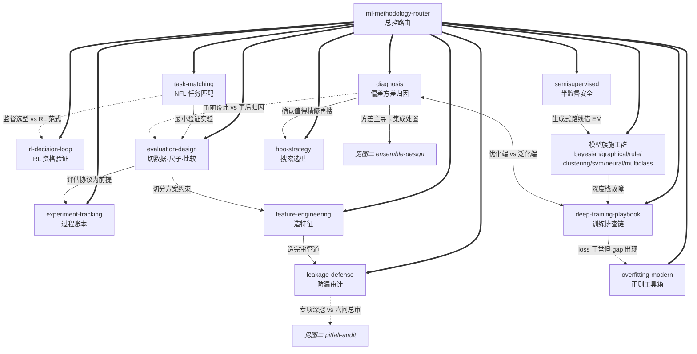
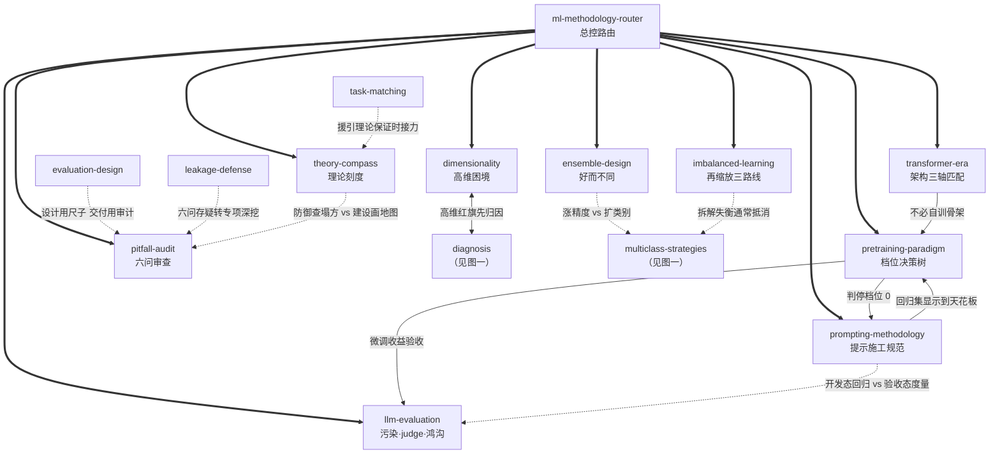

# 《机器学习》（西瓜书）方法论 Skill 合集 — Index

> 本书由 cangjie-skill 蒸馏，共产出 **28** 个 skills（1 总控路由 + 27 子 skill）。
> 处理时间：2026-08-24

## 关于这本书与这套合集

- **作者**：周志华
- **出版年**：2016（清华大学出版社，"西瓜书"）
- **一句话主旨**：机器学习的本质是从有限样本出发在巨大假设空间中做选择以获得泛化能力——一切学习系统的设计都围绕"如何评估、如何选择、如何缓解过拟合"展开。

**合集定位**：这不是一份 ML 知识摘要，而是一套**决策方法论** skill 合集。它把西瓜书里反复出现的判断纪律——"脱离任务谈算法优劣无意义"、"先修尺子再谈诊断"、"训练精度满分是红旗不是捷报"、"理论给出边界而非答案"——蒸馏成 1 个路由总控 + 27 个原子决策框架，覆盖从选型、实验设计、数据准备、模型族施工、训练调参、结果诊断到上线交付的全流程，并外推补全了西瓜书的两大时代盲区：深度现代训练栈与大模型范式。

**来源分层**：
- 批A（9 个子 skill）：原文锚定于西瓜书各章；
- 批B/批C（18 个子 skill）：对原书时代局限的外推补全——工程实践共识（experiment-tracking / feature-engineering / leakage-defense / hpo-strategy 等）与经典文献共识（deep-training-playbook / transformer-era / pretraining-paradigm / prompting-methodology / llm-evaluation 等），各自带时代边界声明。
- **术语词典**：[GLOSSARY.md](./GLOSSARY.md)（西瓜书 62 条核心术语 + 现代术语增补）

---

## Skill 总览（按工作流八段分组）

### ① 选型前

| Skill | 一句话 | 典型触发场景 |
|---|---|---|
| [`ml-methodology-router`](./skills/ml-methodology-router/SKILL.md) | ML 方法论问题总入口：定位用户卡在工作流哪一段再派发 | 任何 ML 决策类提问的第一站；纯代码实现问题不路由 |
| [`ml-task-matching`](./skills/ml-task-matching/SKILL.md) | 没有最强算法，只有匹配任务的算法（NFL → 刻画任务 → 匹配归纳偏好） | "该用什么模型""榜单第一能搬吗""两个模型打平选哪个" |
| [`ml-rl-decision-loop`](./skills/ml-rl-decision-loop/SKILL.md) | 强化学习资格验证 + 范式内路线选型（有模型/免模型/探索利用） | "RL 能不能做 X""reward 怎么设计""Q-learning 还是 Sarsa" |

### ② 实验设计与数据准备

| Skill | 一句话 | 典型触发场景 |
|---|---|---|
| [`ml-evaluation-design`](./skills/ml-evaluation-design/SKILL.md) | 实验三层设计：切数据 · 选尺子 · 信比较 | "留出还是交叉验证""99% 精度好不好""高 0.5% 显著吗" |
| [`ml-experiment-tracking`](./skills/ml-experiment-tracking/SKILL.md) | 实验可复现纪律手册：种子/配置/环境/checkpoint 全上账本 | "复现不了结果""checkpoint 该存什么""实验太多管不过来" |
| [`ml-feature-engineering`](./skills/ml-feature-engineering/SKILL.md) | 从原始字段构造特征的决策链：先切分→体检→逐列处理→复盘 | "这列怎么编码""滞后特征会不会偷看未来""target encoding 安全吗" |
| [`ml-leakage-defense`](./skills/ml-leakage-defense/SKILL.md) | 数据泄漏专项防御：三大类型定位 + 检测信号 + 上线清单 | "线下虚高线上暴跌""这个特征重要性也太高了吧""归一化放切分前还是后" |
| [`ml-semisupervised`](./skills/ml-semisupervised/SKILL.md) | 少量标注+大量未标注的路线选型与安全纪律 | "只有几百条标注怎么用无标注""pseudo-label 反而掉点""协同训练前提" |

### ③ 模型族内部施工

| Skill | 一句话 | 典型触发场景 |
|---|---|---|
| [`ml-bayesian-thinking`](./skills/ml-bayesian-thinking/SKILL.md) | 概率建模的假设纪律：分布形式先于参数、独立性档位、EM 纪律、推断降级 | "朴素贝叶斯假设不成立""EM 不收敛""变分 vs MCMC 怎么选" |
| [`ml-graphical-models`](./skills/ml-graphical-models/SKILL.md) | 多变量依赖的图建模与推断路线决策树（有向/无向 → 结构 → 推断降级） | "贝叶斯网结构怎么定""HMM 还是 CRF""推断跑不动换什么" |
| [`ml-rule-learning`](./skills/ml-rule-learning/SKILL.md) | 可解释 if-then 规则的适用判断与方法路线（命题 vs 一阶、序贯覆盖、剪枝后处理） | "必须能向监管解释每个判断""JRIP 规则全落进默认规则""ILP 要不要上" |
| [`ml-clustering-toolkit`](./skills/ml-clustering-toolkit/SKILL.md) | 聚类选型与评估流程：定 k · 选范式 · 选距离 · 簇≠真实类别 | "聚类分几类""kmeans 还是 dbscan""轮廓系数 0.42 能说最优吗" |
| [`ml-svm-playbook`](./skills/ml-svm-playbook/SKILL.md) | SVM 使用决策树：软间隔默认 · 核选型纪律 · C 与 γ · 规模判死 | "C 和 gamma 怎么设""加核完美分开了！""文本该用什么核" |
| [`ml-neural-training`](./skills/ml-neural-training/SKILL.md) | 经典神经网络训练纪律：可分性定结构 · loss 分诊 · 局部极小 · 早停+正则 | "手写 BP 网络 loss 震荡""几个 hidden layer""是不是撞局部极小" |
| [`ml-multiclass-strategies`](./skills/ml-multiclass-strategies/SKILL.md) | 二分类器解决 N 类问题的拆解工程（OvO/OvR/ECOC 开销矩阵） | "ovo ovr 区别""ECOC 码本怎么设计""一万类还能两两配对吗" |

### ④ 训练与调参

| Skill | 一句话 | 典型触发场景 |
|---|---|---|
| [`ml-deep-training-playbook`](./skills/ml-deep-training-playbook/SKILL.md) | 深度网络训不动的固定排查链：先廉价检查后昂贵实验，每步带完成标准 | "loss 不降/NaN""Xavier 还是 He""warmup 要不要加""梯度消失了怎么确诊" |
| [`ml-overfitting-modern`](./skills/ml-overfitting-modern/SKILL.md) | 深度正则工具箱 + 双下降甄别：gap 在深度区间可能不是病 | "dropout 放哪层""正则叠加打架""训练 loss=0 泛化反而好" |
| [`ml-hpo-strategy`](./skills/ml-hpo-strategy/SKILL.md) | 超参搜索选型：算法对比 · 空间设计 · 预算分配 · 止损判停 | "grid 还是 Optuna""学习率对数尺度吗""调了一百个 trial 还没起色" |

### ⑤ 结果诊断

| Skill | 一句话 | 典型触发场景 |
|---|---|---|
| [`ml-diagnosis`](./skills/ml-diagnosis/SKILL.md) | 先分清病种再开药：偏差/方差/噪声归因；"太好了"也是病 | "过拟合怎么办""该加数据还是加模型""训练精度 100%！" |

### ⑥ 特殊场景

| Skill | 一句话 | 典型触发场景 |
|---|---|---|
| [`ml-imbalanced-learning`](./skills/ml-imbalanced-learning/SKILL.md) | 类别不平衡：确认度量失守 → 按部署约束在再缩放三路线中选路 | "accuracy 99.9% 但欺诈召回为 0""SMOTE 有没有坑""阈值移动" |
| [`ml-ensemble-design`](./skills/ml-ensemble-design/SKILL.md) | 集成设计：好而不同 · 降对项（Boosting 降偏差/Bagging 降方差）· 选对通道与结合法 | "多模型融合会更好吗""bagging 还是 boosting""stacking 线上线下不一致" |
| [`ml-dimensionality`](./skills/ml-dimensionality/SKILL.md) | 高维困境决策链：症状诊断 → 降维/特征选择/L1 稀疏/度量学习四主线选路 | "p≫n 怎么办""kNN 忽好忽坏""PCA 效果差""评分矩阵能否补全" |

### ⑦ 大模型场景

| Skill | 一句话 | 典型触发场景 |
|---|---|---|
| [`ml-transformer-era`](./skills/ml-transformer-era/SKILL.md) | 深度时代的架构选型：数据形态×规模×算力三轴匹配 CNN/RNN/Transformer | "Transformer 还是 CNN""QKV 是什么""小数据能用 ViT 吗" |
| [`ml-pretraining-paradigm`](./skills/ml-pretraining-paradigm/SKILL.md) | 预训练-微调范式四档决策树：从零训练/全参微调/LoRA/纯提示选最低够用档 | "要不要自己训""LoRA 还是全参""微调后通用能力变笨了" |
| [`ml-prompting-methodology`](./skills/ml-prompting-methodology/SKILL.md) | 提示即编程：回归测试驱动迭代 · few-shot 选择 · CoT 边界 · schema 约束 | "prompt 时好时坏""few-shot 放几个""CoT 有没有必要""JSON 解析失败" |
| [`ml-llm-evaluation`](./skills/ml-llm-evaluation/SKILL.md) | 大模型评估纪律：榜单是参照物不是成绩单；污染三探针；judge 偏差校正 | "榜单排名和实测为什么不一致""测试集是不是背过答案""GPT 打分靠谱吗" |

### ⑧ 工程交付

| Skill | 一句话 | 典型触发场景 |
|---|---|---|
| [`ml-pitfall-audit`](./skills/ml-pitfall-audit/SKILL.md) | 上线前六问前提审查：无偏采样/独立采样/分布形式/误差独立/桥接假设/信息泄露 | "线下好线上崩""结果好得可疑""投稿前 sanity check" |
| [`ml-theory-compass`](./skills/ml-theory-compass/SKILL.md) | 把学习理论当提问框架：PAC 三问、容量三刻度、MDL、替代损失、单调证书 | "需要多少数据才够""准确率要 99% 怎么谈""理论上说该信几分" |

---

## 引用图

图太密分两张：主流程图覆盖工作流主干（①–⑤），横向图覆盖特殊场景/大模型/工程交付（⑥–⑧）。

### 图一：主流程（选型 → 数据准备 → 施工 → 训练 → 诊断）



### 图二：特殊场景 · 大模型 · 工程交付



图例：
- `===>` composes-with（router 组合派发全部子 skill）
- `-->` depends-on / 时序接力
- `-.->` contrasts-with（对照分界）
- `<-->` 双向接力（互为闸门/移交）

---

## 推荐使用路径

### 新手路径（沿合集主干走一遍全流程）

1. **`ml-methodology-router`** — 唯一入口，先学会定位"我卡在哪一段"
2. **`ml-task-matching`** — 最上游：任何项目开工前先刻画任务、匹配归纳偏好（RL 形态的任务先过 `ml-rl-decision-loop` 的资格验证）
3. **`ml-evaluation-design`** — 选型之后必须科学评估：切数据、定尺子、定比较协议
4. **`ml-experiment-tracking` + `ml-feature-engineering`** — 开跑之前把账本和特征管道立起来：种子/配置/checkpoint 记全，各列按处理链过一遍，交付前接一道 **`ml-leakage-defense`**
5. 进入模型族施工或大模型链路：经典模型族各有专属 playbook（SVM/聚类/规则/概率图……）；深度与大模型场景按 `ml-transformer-era` 选架构 → `ml-pretraining-paradigm` 定档位 → `ml-prompting-methodology` 做提示施工 → `ml-llm-evaluation` 做能力验收；训练环节故障走 `ml-deep-training-playbook` 排查链，泛化缺口走 `ml-overfitting-modern`
6. 结果不如意 → **`ml-diagnosis`** 系统归因（偏差/方差/噪声），按归因结果决定加数据、换容量还是精修超参（→ `ml-hpo-strategy`）
7. 交付前一律过一遍 **`ml-pitfall-audit`** 六问收尾闸门

### 老手路径（按需直取）

- 已有明确领域信号（"99% accuracy 召回 0""stacking 泄露""p≫n""loss NaN""prompt 时好时坏"）→ 直接激活对应专项 skill，不必经过 router
- 只有一个汇总数字要判断可信度 → `ml-pitfall-audit`（防御）或 `ml-theory-compass`（建设），二选一按问题性质
- 写论文/汇报前的比较检验 → `ml-evaluation-design` 第 3 层（Friedman+Nemenyi 流程）
- 深度训练翻车急救 → `ml-deep-training-playbook` 的固定排查链按序执行，先廉价后昂贵

### 串联纪律

router 是唯一调度入口；子 skill 之间不互相调用，接力一律经由 router 步骤 5 的串联规则（单次派发不超过 2 个子 skill）。高频链路：

- 经典链路（verified 单元证据）：diagnosis 方差主导 → ensemble-design；evaluation-design 发现不平衡 → imbalanced-learning；task-matching 援引理论保证 → theory-compass；evaluation-design 完成 + 要交付 → pitfall-audit
- 扩展链路（批B/批C）：diagnosis 确认值得精修 → hpo-strategy；feature-engineering 构造完 → leakage-defense 审管道；transformer-era 判"不必自训" → pretraining-paradigm 选档位 → 判停档位 0 → prompting-methodology 施工；pretraining-paradigm 微调验收 → llm-evaluation 补污染检查；pitfall-audit 六问泄漏存疑 → leakage-defense 深挖

---

## 安装使用

本目录是构建产物，宿主不会从这里加载 skill。要让 agent 真正调用，把 skill 目录复制到宿主的 skills 目录：

```bash
# 用户级（所有项目可用）— router 是唯一入口，必装
cp -r skills/ml-methodology-router ~/.claude/skills/

# 子 skill 按需安装（建议至少安装所在工作流段的整组）
cp -r skills/<skill-slug> <project>/.claude/skills/    # Claude Code
cp -r skills/<skill-slug> <project>/.cursor/skills/    # Cursor
```

---

## 测试与接入 darwin-skill

28 个 skill 各带 `test-prompts.json`（9 条/个，共 252 条：4 should_trigger + 3 should_not_trigger + 2 edge_case），其中每份的 should_not_trigger 至少含 1 条跨 skill 混淆诱饵。可直接接入自动进化：

```
darwin evolve skills/
```
