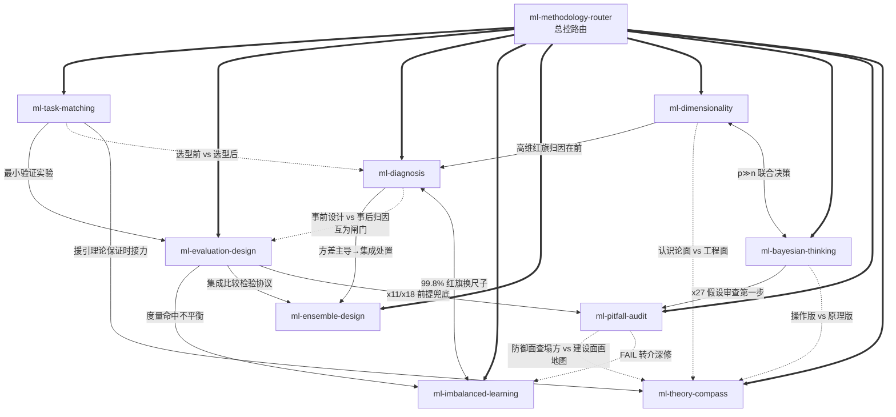

# 《机器学习》（西瓜书）方法论 Skill 合集 — Index

> 本书由 cangjie-skill 蒸馏，共产出 **10** 个 skills。
> 处理时间：2026-08-24

## 关于这本书与这套合集

- **作者**：周志华
- **出版年**：2016（清华大学出版社，"西瓜书"）
- **一句话主旨**：机器学习的本质是从有限样本出发在巨大假设空间中做选择以获得泛化能力——一切学习系统的设计都围绕"如何评估、如何选择、如何缓解过拟合"展开。

**合集定位**：这不是一份 ML 知识摘要，而是一套**决策方法论** skill 合集。它把西瓜书里反复出现的判断纪律——"脱离任务谈算法优劣无意义"、"先修尺子再谈诊断"、"训练精度满分是红旗不是捷报"、"理论给出边界而非答案"——蒸馏成 1 个路由总控 + 9 个原子决策框架。当用户提出任何涉及 ML 决策/判断的问题时（选型、实验设计、结果诊断、特殊场景），由 router 定位其所处阶段并派发到对应 skill；每个 skill 内部都带原文锚点、可执行步骤与判停条件，产出的是任务画像表、诊断结论、审计报告等可交付工件，而不是泛泛的建议。
- **术语词典**：[GLOSSARY.md](./GLOSSARY.md)（62 条核心术语，定义忠实原书上下文）

---

## Skill 总览

| Skill | 一句话 | 典型触发场景 |
|---|---|---|
| [`ml-methodology-router`](./skills/ml-methodology-router/SKILL.md) | ML 方法论问题总入口：定位用户卡在工作流哪一段再派发 | 任何 ML 决策类提问的第一站；纯代码实现问题不路由 |
| [`ml-task-matching`](./skills/ml-task-matching/SKILL.md) | 没有最强算法，只有匹配任务的算法（NFL → 刻画任务 → 匹配归纳偏好） | "该用什么模型""榜单第一能搬吗""两个模型打平选哪个" |
| [`ml-evaluation-design`](./skills/ml-evaluation-design/SKILL.md) | 实验三层设计：切数据 · 选尺子 · 信比较 | "留出还是交叉验证""99% 精度好不好""高 0.5% 显著吗" |
| [`ml-diagnosis`](./skills/ml-diagnosis/SKILL.md) | 先分清病种再开药：偏差/方差/噪声归因；"太好了"也是病 | "过拟合怎么办""该加数据还是加模型""训练精度 100%！" |
| [`ml-imbalanced-learning`](./skills/ml-imbalanced-learning/SKILL.md) | 类别不平衡：确认度量失守 → 按部署约束在再缩放三路线中选路 | "accuracy 99.9% 但欺诈召回为 0""SMOTE 有没有坑""阈值移动" |
| [`ml-ensemble-design`](./skills/ml-ensemble-design/SKILL.md) | 集成设计：好而不同 · 降对项（Boosting 降偏差/Bagging 降方差）· 选对通道与结合法 | "多模型融合会更好吗""bagging 还是 boosting""stacking 线上线下不一致" |
| [`ml-dimensionality`](./skills/ml-dimensionality/SKILL.md) | 高维困境决策链：症状诊断 → 降维/特征选择/L1 稀疏/度量学习四主线选路 | "p≫n 怎么办""kNN 忽好忽坏""PCA 效果差""评分矩阵能否补全" |
| [`ml-bayesian-thinking`](./skills/ml-bayesian-thinking/SKILL.md) | 概率建模的假设纪律：分布形式先于参数、独立性档位、EM 纪律、推断降级 | "朴素贝叶斯假设不成立""EM 不收敛""变分 vs MCMC 怎么选" |
| [`ml-pitfall-audit`](./skills/ml-pitfall-audit/SKILL.md) | 上线前六问前提审查：无偏采样/独立采样/分布形式/误差独立/桥接假设/信息泄露 | "线下好线上崩""结果好得可疑""投稿前 sanity check" |
| [`ml-theory-compass`](./skills/ml-theory-compass/SKILL.md) | 把学习理论当提问框架：PAC 三问、容量三刻度、MDL、替代损失、单调证书 | "需要多少数据才够""准确率要 99% 怎么谈""理论上说该信几分" |

---

## 引用图



图例：
- `===>` composes-with（router 组合派发全部子 skill）
- `-->`  depends-on（使用前提）
- `-.->` contrasts-with（对照分界）
- `<-->` 双向接力（互为闸门/移交）

---

## 推荐使用路径

### 新手路径（沿书的主干走一遍）

1. **`ml-methodology-router`** — 唯一入口，先学会定位"我卡在哪一段"
2. **`ml-task-matching`** — 最上游：任何项目开工前先刻画任务、匹配归纳偏好
3. **`ml-evaluation-design`** — 选型之后必须科学评估：切数据、定尺子、定比较协议
4. **`ml-diagnosis`** — 结果不如意时的系统归因：偏差/方差/噪声，对症下药
5. 之后按遇到的问题进入专项：不平衡走 `ml-imbalanced-learning`，冲榜走 `ml-ensemble-design`，高维走 `ml-dimensionality`，概率建模走 `ml-bayesian-thinking`
6. 交付前一律过一遍 **`ml-pitfall-audit`** 六问收尾闸门

### 老手路径（按需直取）

- 已有明确领域信号（"99% accuracy 召回 0""stacking 泄露""p≫n"）→ 直接激活对应专项 skill，不必经过 router
- 只有一个汇总数字要判断可信度 → `ml-pitfall-audit`（防御）或 `ml-theory-compass`（建设），二选一按问题性质
- 写论文/汇报前的比较检验 → `ml-evaluation-design` 第 3 层（Friedman+Nemenyi 流程）

### 串联纪律

router 是唯一调度入口；子 skill 之间不互相调用，接力一律经由 router 步骤 5 的串联规则（单次派发不超过 2 个子 skill）。高频链路（均出自 verified 单元证据）：diagnosis 方差主导 → ensemble-design；evaluation-design 发现不平衡 → imbalanced-learning；task-matching 援引理论保证 → theory-compass；evaluation-design 完成 + 要交付 → pitfall-audit。

---

## 安装使用

本目录是构建产物，宿主不会从这里加载 skill。要让 agent 真正调用，把 skill 目录复制到宿主的 skills 目录：

```bash
# 用户级（所有项目可用）
cp -r skills/ml-methodology-router ~/.claude/skills/

# 或项目级
cp -r skills/<skill-slug> <project>/.claude/skills/    # Claude Code
cp -r skills/<skill-slug> <project>/.cursor/skills/    # Cursor
```

---

## 接入 darwin-skill

各 skill 的 `test-prompts.json` 尚未生成（阶段 4 任务）；生成后可直接接入自动进化：

```
darwin evolve skills/
```
