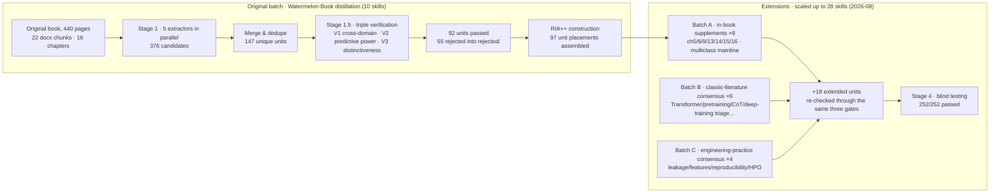

<div align="center">

# Machine-learning-skills

[🇨🇳 简体中文](./README.md) | **[🇺🇸 English](./README.en.md)**

**A full-stack collection of ML methodology skills — skeleton from the Watermelon Book, extended into the deep learning and LLM era**

[](https://github.com/fieldlu/Machine-learning-skills/releases/tag/v0.0.1)
[](./LICENSE)


[](https://claude.com/claude-code)

> 🚧 **v0.0.1 — First public release**. This collection is in its early stages; structure and content will keep iterating. Feedback on inaccurate triggers or content errors via Issues is welcome.

</div>

---

## What is this

This is not yet another machine-learning knowledge digest. It is a **collection of decision-making methodologies that AI agents can invoke directly** — **28 skills** spread across the full ML workflow (central router → model selection & evaluation → training diagnosis & tuning → model-family playbooks → data & features → the LLM era → pre-launch defense). Its knowledge comes from three layers of different natures, honestly labeled as such:

1. **🍉 Watermelon-Book verified units** (router + 17 sub-skills) — The recurring judgment disciplines in Zhou Zhihua's《机器学习》(*Machine Learning*, a.k.a. the "Watermelon Book") (2016) — "comparing algorithms apart from the task is meaningless", "fix the yardstick before talking diagnosis", "a perfect training score is a red flag, not a triumph", "theory gives bounds, not answers" — were distilled into atomic decision frameworks after passing three verification gates (cross-domain reproduction / predictive power / distinctiveness). Their R sections quote the original book verbatim, with chapter citations.
2. **📜 Classic-literature consensus extrapolations** (6 "LLM era" skills) — Topics such as the Transformer architecture, the pretrain–finetune paradigm, and chain-of-thought postdate the original book, so their content is instead constructed from widely accepted conclusions in the foundational literature (*Attention Is All You Need*, BERT, GPT-3, Scaling Laws, CoT, the *Deep Learning* textbook, etc.). Their R sections are paraphrases of the literature, each individually marked "(paraphrased)" — they are not the book's words.
3. **🛠️ Engineering-practice supplements** (4 "engineering" skills) — Data-leakage defense, feature engineering, experiment reproducibility, and hyperparameter search are topics the original book explicitly does not cover, so their content is constructed from public industry consensus (the official scikit-learn documentation, Google's *Rules of Machine Learning*, *Hidden Technical Debt in ML Systems*, etc.). They are disciplines and common practice — not theorems.

Every skill carries:

- 📖 **Source anchor** (R): book-based skills quote the original text verbatim (≤150 characters, with the source noted); literature/engineering skills paraphrase foundational papers or industry documents, with the nature of the source labeled
- 🦴 **Methodology skeleton** (I): the original wording rewritten as an actionable decision structure
- 📚 **Classic cases** (A1): cases worked through by hand by the author, or original experiment narratives from the foundational literature
- 🎯 **Trigger scenarios** (A2): bilingual language signals telling the agent when to activate — and when not to
- ✅ **Execution steps** (E): every step has completion criteria and stop conditions
- ⚠️ **Boundary warnings** (B): when it fails + source blind spots + counter-scenarios

## ✨ Features

- **🔬 97 triple-verified units + 18 extended units** — All book-derived content passed the three gates of V1 cross-domain reproduction / V2 predictive power / V3 distinctiveness; rejection records are archived and traceable, and extended units were tested to the same standard
- **📐 Uniform RIA++ six-section structure** — All 28 skills share one structure (Reading / Interpretation / Past Application / Future Trigger / Execution / Boundary); an agent that has read one recognizes them all
- **🧭 Central router** — `ml-methodology-router` is the single dispatch entry point: it first locates where you are stuck in the workflow, then dispatches the matching sub-skill
- **🧪 252/252 blind tests passed** — Every skill ships with a `test-prompts.json` (should-trigger cases + confusable decoys + edge cases), graded by independent blind testers who never saw the expected answers; compatible with darwin-skill for direct evolution
- **🔗 Zettelkasten link network** — Inter-skill relationships (depends-on / contrasts-with / composes-with) are all declared explicitly; see the reference graph in [INDEX.md](./INDEX.md)

## 📦 Installation

**Option 1: Claude Code user-level install (recommended)**

```bash
# v0.0.1, the first published release
git clone -b v0.0.1 https://github.com/fieldlu/Machine-learning-skills.git
cp -r Machine-learning-skills/skills/* ~/.claude/skills/
```

**Option 2: Clone, then place per host**

```bash
# Project-level (available to the current project only)
cp -r skills/<skill-slug> <project>/.claude/skills/    # Claude Code
cp -r skills/<skill-slug> <project>/.cursor/skills/    # Cursor
```

**Option 3: Manually copy a single skill**

Only need one specialty (say, leakage defense)? Just copy the single directory `skills/ml-leakage-defense/` into your host's skills directory. Each skill directory is self-contained (SKILL.md + test files) and depends on nothing else in the repo. One piece of advice: if you install everything, the router will chain the other 27 skills for you automatically.

## 🚀 Quick Start

Once installed, simply ask your agent questions as usual. Five real scenarios:

**① "Which algorithm should I use?"** → the router locates pre-selection thinking → dispatches `ml-task-matching`

> **You**: We're building a fraud detector. The team says XGBoost tops the leaderboards — should we just go with it?
>
> **Agent**: Set the leaderboard aside for a moment — the NFL theorem proves that ranking algorithms without reference to a concrete task is meaningless. First characterize your task: how large is your sample? What is the class ratio? Are error costs symmetric? Fraud detection usually has extreme class imbalance and high missed-detection costs, which means the "most accurate" algorithm is almost guaranteed to be the wrong choice here. Let's profile the task first, then match an inductive bias…

**② "My model is overfitting!"** → the router locates result diagnosis → dispatches `ml-diagnosis`

> **You**: Training accuracy is 100% but validation is only 82%. Would a few more epochs fix it?
>
> **Agent**: A perfect score on the training set is a **red flag here, not a triumph**. Attribute it with a bias-variance decomposition: a large training/validation gap means variance dominates (the model has memorized the answers), and more epochs will only make it worse. The prescription direction is variance reduction: more data, stronger regularization, early stopping, or attaching a Bagging-style ensemble. One more note: overfitting cannot be eliminated, only mitigated (eradicating it outright would amount to solving an NP-hard problem) — the goal is to manage the risk, not annihilate it.

**③ "Ready to launch"** → the router locates horizontal review → dispatches `ml-pitfall-audit`

> **You**: Offline AUC is 0.99. We ship next week.
>
> **Agent**: When results look suspiciously good, run the six-question premise audit before scheduling: (1) Was the training data sampled without bias? (2) Is the test error rate based on independent sampling? (3) Is the distributional-form assumption right? (4) … (6) Could that 0.99 be information leakage? Each question has observable diagnostic signals and corrective actions attached. Thirty seconds of auditing trades away the post-mortem attribution session after a failed launch.

**④ "How do I tune my SVM?"** → the router locates model-family playbooks → dispatches `ml-svm-playbook`

> **You**: I want to use an SVM. Which kernel should I pick? How do I tune C and gamma?
>
> **Agent**: These aren't parallel questions — they form a single decision chain. Ask about separability first: if the data is linearly separable, no kernel is needed; if it is linearly inseparable but noisy, the soft margin reframes "get everything right" as "minimize total cost" (that is where C comes from). Only when nonlinear expression is genuinely required do you enter kernel selection, where RBF is the default starting point — and there, C (tolerance for errors) and γ (the influence radius of a single sample) must be swept jointly on a log scale, because raising either pushes toward overfitting. Finally there is a scale gate: SVM training cost grows superlinearly with sample size, so at a few hundred thousand rows, consider a linear model or tree ensemble first, then come back.

**⑤ "We want to fine-tune LLaMA"** → the router locates the LLM era → dispatches `ml-pretraining-paradigm`

> **You**: We want to fine-tune LLaMA for customer-support QA. Can we jump straight to full-parameter fine-tuning?
>
> **Agent**: Don't reach for the highest tier first. Task adaptation is a four-tier cost ladder: prompt engineering (zero training) → PEFT such as LoRA (base weights frozen; around a thousand examples suffice) → full fine-tuning (only worth it above the ~100k mark, and the fastest way to wash out pretrained capabilities) → pretraining from scratch (the vast majority of teams will never need this). The correct order is to start with prompt engineering and few-shot baselines: direct fine-tuning is forbidden below 1k samples. If you do eventually reach fine-tuning, put two disciplines in place beforehand — hold back a set of general-capability regression tests to detect catastrophic forgetting, and remember: the farther your domain sits from the pretraining distribution, the stronger your case for moving up a tier.

Pure code-implementation questions (sklearn syntax, stack traces) are not routed — they get answered directly and skip the methodology workflow.

## 🗂️ The 28 Skills at a Glance

Source legend: 🍉 Watermelon-Book source anchors · triple-verified (original batch) | 🌱 Watermelon-Book pool extensions · verified to the same standard (Batch A) | 📜 Classic-literature consensus (Batch B) | 🛠️ Engineering-practice consensus (Batch C)

### 🧭 Router

| Skill | One-liner | Typical trigger phrases |
|---|---|---|
| [`ml-methodology-router`](./skills/ml-methodology-router/SKILL.md) 🍉 | Single entry point: locates where you are stuck in the workflow, then dispatches | First stop for any ML decision-type question |

### 📐 Model Selection & Evaluation Design

| Skill | One-liner | Typical trigger phrases |
|---|---|---|
| [`ml-task-matching`](./skills/ml-task-matching/SKILL.md) 🍉 | There is no strongest algorithm, only the algorithm matched to your task (NFL → profile the task → match the inductive bias) | "which model should I use" "can a leaderboard winner transfer" |
| [`ml-evaluation-design`](./skills/ml-evaluation-design/SKILL.md) 🍉 | Three layers of experiment design: split the data · pick the ruler · trust the comparison | "holdout or cross-validation" "is +0.5% significant" |
| [`ml-llm-evaluation`](./skills/ml-llm-evaluation/SKILL.md) 📜 | LLM evaluation: leaderboards are reference points, not report cards; check contamination, define rubrics, calibrate judge bias | "why does the leaderboard rank disagree with my own evals" "is the test set contaminated" |

### 🔬 Training Diagnosis & HPO

| Skill | One-liner | Typical trigger phrases |
|---|---|---|
| [`ml-diagnosis`](./skills/ml-diagnosis/SKILL.md) 🍉 | Identify the disease before prescribing: bias/variance/noise attribution | "how do I fix overfitting" "training accuracy is 100%!" |
| [`ml-overfitting-modern`](./skills/ml-overfitting-modern/SKILL.md) 📜 | The deep regularization toolbox and the new signal that a gap ≠ overfitting (Dropout/augmentation/AdamW/double-descent triage) | "which layers should get Dropout" "training loss is 0 but the gap is huge" |
| [`ml-deep-training-playbook`](./skills/ml-deep-training-playbook/SKILL.md) 📜 | When training stalls, rule things out in a fixed order: data pipeline → small-sample overfit → initialization & normalization → learning rate → optimizer | "loss won't go down" "NaN" "do I need warmup" |
| [`ml-hpo-strategy`](./skills/ml-hpo-strategy/SKILL.md) 🛠️ | Spend your tuning budget where it pays back: choosing among grid/random/Bayesian/Hyperband | "grid or random search" "budget only covers N trials" |
| [`ml-experiment-tracking`](./skills/ml-experiment-tracking/SKILL.md) 🛠️ | The reproducibility quintuple: pin down code × data × config × environment × randomness | "two runs disagree" "how do I manage seeds" |

### 🌳 Model Family Playbooks

| Skill | One-liner | Typical trigger phrases |
|---|---|---|
| [`ml-neural-training`](./skills/ml-neural-training/SKILL.md) 🌱 | Decision discipline for training neural networks: when to use NNs, how to shape the architecture, how to rescue stalled training | "how many hidden layers" "how do I tune the learning rate" |
| [`ml-svm-playbook`](./skills/ml-svm-playbook/SKILL.md) 🌱 | The SVM decision chain: separability → hard/soft margin → kernel selection → C & γ tuning → feasibility at scale | "how to choose SVM parameters" "which kernel" |
| [`ml-clustering-toolkit`](./skills/ml-clustering-toolkit/SKILL.md) 🌱 | Clustering selection and evaluation: distance before algorithm, how to set K, how to read the silhouette coefficient | "how many clusters" "kmeans or dbscan" |
| [`ml-multiclass-strategies`](./skills/ml-multiclass-strategies/SKILL.md) 🌱 | Multiclass decomposition: route among OvO/OvR/ECOC by class count and error-correcting needs | "OvO vs OvR difference" "ECOC codebook design" |
| [`ml-ensemble-design`](./skills/ml-ensemble-design/SKILL.md) 🍉 | Ensemble design: good and different · Boosting cuts bias / Bagging cuts variance | "will combining models help" "stacking disagrees between offline and online" |
| [`ml-imbalanced-learning`](./skills/ml-imbalanced-learning/SKILL.md) 🍉 | Class imbalance: confirm the metric has broken down → then choose among three rescaling routes | "99.9% accuracy but zero recall" "any pitfalls with SMOTE" |
| [`ml-bayesian-thinking`](./skills/ml-bayesian-thinking/SKILL.md) 🍉 | Assumption discipline for probabilistic modeling: distributional form before parameters, independence tiers, EM and inference fallbacks | "naive Bayes assumptions don't hold" "EM won't converge" |
| [`ml-graphical-models`](./skills/ml-graphical-models/SKILL.md) 🌱 | Probabilistic graphical modeling and inference routes: when HMMs fit, how to decide network structure, variational vs MCMC | "how do I model dependencies between variables" "inference is too slow" |
| [`ml-rule-learning`](./skills/ml-rule-learning/SKILL.md) 🌱 | "Human-readable" if-then rule models: applicability checks and methodological routes | "we need interpretable rules" "rule set keeps firing the default rule" |
| [`ml-rl-decision-loop`](./skills/ml-rl-decision-loop/SKILL.md) 🌱 | Whether to use RL at all, and which route: model-based vs model-free, MC vs TD, Sarsa vs Q-learning | "how to design the reward" "Q-learning vs Sarsa difference" |
| [`ml-semisupervised`](./skills/ml-semisupervised/SKILL.md) 🌱 | Route selection and safety discipline for exploiting unlabeled data when labels are scarce | "how to use unlabeled data" "pseudo-labeling hurt my score" |

### 🗺️ Data & Features

| Skill | One-liner | Typical trigger phrases |
|---|---|---|
| [`ml-dimensionality`](./skills/ml-dimensionality/SKILL.md) 🍉 | The high-dimensional predicament: symptom diagnosis → routing across four main lines (dimensionality reduction / feature selection / sparsity / metric learning) | "p≫n, what do I do" "kNN is great one day, terrible the next" |
| [`ml-feature-engineering`](./skills/ml-feature-engineering/SKILL.md) 🛠️ | Split first, engineer second — statistics may trust training folds only; decision trees for numeric / categorical / time / cross fields | "one-hot or target encoding" "how do I handle high cardinality" |
| [`ml-leakage-defense`](./skills/ml-leakage-defense/SKILL.md) 🛠️ | Locating the three major types of data leakage, plus a pre-emptive leak-prevention checklist | "great offline, collapses online" "normalize before or after splitting" |

### 🧠 LLM Era

| Skill | One-liner | Typical trigger phrases |
|---|---|---|
| [`ml-transformer-era`](./skills/ml-transformer-era/SKILL.md) 📜 | Architecture selection matched along three axes — data shape × scale × compute — against the "Transformer is universal" reflex | "CNN/RNN or Transformer" "what are positional encodings for" |
| [`ml-pretraining-paradigm`](./skills/ml-pretraining-paradigm/SKILL.md) 📜 | The four-tier pretraining-paradigm decision tree: prompting → PEFT → full fine-tuning → from scratch; take the lowest tier that suffices | "should we train our own model" "LoRA or full fine-tuning" |
| [`ml-prompting-methodology`](./skills/ml-prompting-methodology/SKILL.md) 📜 | Prompting is programming: few-shot selection, CoT boundaries, schema constraints, regression-test-driven iteration | "my prompt works and fails unpredictably" |

### 🛡️ Defense & Theory

| Skill | One-liner | Typical trigger phrases |
|---|---|---|
| [`ml-pitfall-audit`](./skills/ml-pitfall-audit/SKILL.md) 🍉 | Six-question premise audit before launch: unbiased sampling / independent sampling / distributional form / independent errors / bridging assumption / information leakage | "works offline, crashes online" "results look too good" |
| [`ml-theory-compass`](./skills/ml-theory-compass/SKILL.md) 🍉 | Treat learning theory as a question-asking framework: the three PAC questions, capacity scales, MDL, surrogate losses | "how much data is enough" "how much should I trust theory" |

Newcomers are encouraged to walk the recommended path in [INDEX.md](./INDEX.md) once end to end (router → task-matching → evaluation-design → diagnosis → specialty playbooks → pitfall-audit to close out); veterans can go straight to a specialty via its language signals.

## 🧠 How This Collection Was Built

Built with cangjie-skill's **RIA-TV++ six-stage pipeline**, starting from the original book's 440 pages, with human review throughout; since 2026-08 the same pipeline and the same acceptance standard have extended the collection to 28 skills:



The pipeline's key discipline: **extraction ≠ admission**. After the original batch's five extractor tracks (frameworks / principles / counterexamples / cases / terms) each swept the whole book to produce candidates, an independent verifier ran every candidate through three gates — can it be reproduced across domains (V1)? Does it predict real scenarios (V2)? Is it more than repackaged common sense (V3)? — and admitted it only if all three passed; rejection records remain archived and inspectable. Batch A reused the same process to verify supplemental units outside the Stage-1.5 pool. Batch B/C topics are absent from the book, so their content was constructed from foundational literature and public industry consensus instead — but every R-section entry is labeled with its source and its paraphrase status, and passes tests of the same standard as the in-book units.

## 📊 Verification Funnel

| Stage | Count | Details |
|---|---|---|
| Text source | 440 pages · ~367k characters | 22 docx chunks, 16 chapters |
| Candidates from five extractors | **376** | frameworks 44 + principles 50 + counterexamples 51 + cases 38 + terms 193 |
| Unique units after merge & dedupe | **147** | framework/principle pool 94→58; counterexample/case pool 89 |
| Passed triple verification | **92** (63%) | 39 frameworks/principles + 53 counterexamples/cases; 55 rejected and archived |
| Assembled into the original batch's 10 skills | **97 unit placements** | a few core units serve multiple skills (e.g., bias-variance) |
| Batch A · in-book supplements | **8 new skills** | covering ch5/6/9/13/14/15/16 plus the ch3 multiclass mainline; source units came from outside the Stage-1.5 pool, and R quotes were checked word-for-word against the original text |
| Batch B · literature consensus | **6 new skills** | R sections paraphrase foundational work by Vaswani/Kaplan/Devlin/Brown/Wei/Glorot/He/Srivastava/Belkin/Zheng/Liang et al., each entry marked "(paraphrased)" |
| Batch C · engineering consensus | **4 new skills** | public industry consensus: the official scikit-learn docs, Google's *Rules of ML*, *Hidden Technical Debt*, etc. |
| Extended units total | **+18** | Batch A pool extensions + Batch B/C literature/engineering-consensus units, re-checked under the same V1/V2/V3 gates |
| Blind-test stress run | **252/252 passed** | 9 items per skill: 4 trigger + 3 decoys + 2 boundary (90 original batch + 162 extension) |

Of these, **97 unit placements come from Watermelon-Book triple verification**; Batch B/C units are constructed from literature and engineering consensus, but pass test gates identical in rigor to the in-book units. Blind-test method: blind testers received only a name + description catalog of the 28 skills (no access to expected answers or internal structure) and judged, for each of the 252 test prompts, whether it should trigger and where it should route. Grading details are in each skill's [`test-results.md`](./skills/ml-diagnosis/test-results.md).

## ⚠️ Boundary Statement

An honest account of what each of the three source layers cannot do — exactly as every skill's own B section demands:

- **Limits of Layer 1 (Watermelon-Book units)**: The book was written in 2015–2016, the i.i.d. assumption runs through all sixteen chapters, and distribution shift and domain adaptation receive only passing mentions (Academician Li Wei pointed this out expressly in the book's preface); the textbook format also sacrifices any discussion of "how multiple techniques interact when combined." Content in this layer is faithful to the book's context — for judgments involving the LLM era, please do not look for answers within this layer; that territory belongs to Layer 2.
- **Limits of Layer 2 (Batch B literature consensus)**: The R sections paraphrase the foundational literature rather than quoting it verbatim (every entry is marked "(paraphrased)"); the consensus snapshot largely stops at methods literature from 2017–2023, and later developments (MoE, current long-context practices, multimodal agents, etc.) are not included; literature consensus itself may also be revised by subsequent research — it is newer than the book, but not newer than the future.
- **Limits of Layer 3 (Batch C engineering consensus)**: Industry common practice is not theorem, and specific tool vehicles (Hydra, Optuna, `pip freeze`) age out. What should be inherited is the disciplinary core — "statistics may trust training folds only," "pin experiments with the quintuple," "no search before attribution" — not any particular tool name.

But the argument in the other direction still holds: anywhere serious production or research is at stake (healthcare, industrial systems, scientific discovery), samples are expensive and errors carry heavy costs — the three-layer evaluation system and bias-variance thinking remain irreplaceable fundamentals. And in the LLM era, new disciplines such as "leaderboard scores are reference points, not report cards" and "prompt changes must pass regression tests" are precisely the same skeptical-and-verify attitude carried onto new terrain. What this collection teaches is not any particular algorithm, but the **attitude of staying skeptical toward every learning outcome and verifying it scientifically**.

## 🙏 Acknowledgments

- The **primary knowledge source** of this repository is《机器学习》(*Machine Learning*, a.k.a. the "Watermelon Book") by Zhou Zhihua (Tsinghua University Press, 2016). Copyright of all in-book quotations in the original batch and Batch A remains with the original author and the publisher; this repository is a secondary organization and engineering packaging of the book's methodological structure, intended for study and research purposes.
- The R sections of Batch B / Batch C respectively paraphrase or cite public academic literature (Vaswani, Kaplan, Devlin, Brown, Wei, Glorot, He, Ioffe, Srivastava, Szegedy, Belkin, Zheng, Liang, et al.) and public industry documentation (the official scikit-learn documentation, Google's *Rules of Machine Learning*, *Hidden Technical Debt in Machine Learning Systems*, etc.), with sources and paraphrase status labeled at each point of use.
- If this repository helps your work, please also cite the original book: 周志华. 机器学习. 北京：清华大学出版社，2016. (Zhou Zhihua. *Machine Learning*. Beijing: Tsinghua University Press, 2016.)
- This repository is not affiliated with the original author or the publisher; if any quotation does not match its original source, please open an Issue with the page number/link of the original.
- Pipeline tooling: cangjie-skill (book distillation); test compatibility: darwin-skill; the build was assisted by Claude Code.

## 📄 License

[MIT](./LICENSE) © 2026 fieldlu
