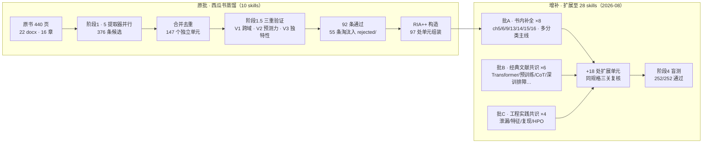

<div align="center">

# Machine-learning-skills

[🇨🇳 简体中文](./README.md) | [🇺🇸 English](./README.en.md)

**以西瓜书方法论为骨架、扩展至深度学习与大模型时代的全栈 ML 方法论 Skill 合集**

[](https://github.com/fieldlu/Machine-learning-skills/releases/tag/v0.0.1)
[](./LICENSE)


[](https://claude.com/claude-code)

> 🚧 **v0.0.1 — 首个公开版本**。合集处于早期阶段，结构与内容会持续迭代；欢迎通过 Issue 反馈触发不准或内容错误。

</div>

---

## 这是什么

这不是又一份机器学习知识点摘要，而是一套 **AI-agent 可直接调用的决策方法论合集**，共 **28 个 skill**，沿 ML 工作流全程铺开（总控路由 → 选型与评估 → 训练诊断调参 → 模型族施工 → 数据与特征 → 大模型时代 → 上线防御）。它的知识来自三层，性质各异、如实标注：

1. **🍉 西瓜书验证单元**（router + 17 个子 skill）——把周志华《机器学习》（2016）里反复出现的判断纪律——"脱离任务谈算法优劣无意义"、"先修尺子再谈诊断"、"训练精度满分是红旗不是捷报"、"理论给出边界而非答案"——经跨域复现 / 预测力 / 独特性三关验证后蒸馏成原子决策框架，R 段逐字引用原书并标注章节。
2. **📜 经典文献共识外推**（6 个"大模型时代" skill）——Transformer 架构、预训练-微调范式、思维链等主题超出原书时代，改从奠基文献（*Attention Is All You Need*、BERT、GPT-3、Scaling Laws、CoT、*Deep Learning* 教科书等）的学界公认结论构造，R 段为逐条标注"（转述）"的文献表述，不是原书文字。
3. **🛠️ 工程实践补全**（4 个"工程落地" skill）——数据泄漏防御、特征工程、实验可复现、超参搜索是原书明确不讲的部分，改从业界公开共识（scikit-learn 官方文档、Google《Rules of Machine Learning》、*Hidden Technical Debt in ML Systems* 等）构造；它们是纪律与通行做法，不是定理。

每个 skill 都带：

- 📖 **原文锚点**（R）：书内 skill 逐字引用原书章节（≤150 字并标注出处）；文献/工程 skill 转述奠基文献或业界文档并注明来源性质
- 🦴 **方法论骨架**（I）：原始表述被重写为可操作的判断结构
- 📚 **经典案例**（A1）：作者亲自演算过的案例，或奠基文献中的原始实验叙述
- 🎯 **触发场景**（A2）：中英双写的语言信号，让 agent 知道何时激活、何时不该
- ✅ **执行步骤**（E）：每步有完成标准与判停条件
- ⚠️ **边界警告**（B）：何时失效 + 来源盲点 + 反场景

## ✨ 特性

- **🔬 97 处三重验证单元 + 18 处扩展单元** — 书内内容全部通过 V1 跨域复现 / V2 预测力 / V3 独特性三关验证，淘汰明细留档可追溯；扩展单元按同规格测试
- **📐 RIA++ 六段同构** — 28 个 skill 共享同一结构（Reading / Interpretation / Past Application / Future Trigger / Execution / Boundary），agent 读一个就认识全部
- **🧭 总控路由** — `ml-methodology-router` 是唯一调度入口：先定位你卡在工作流哪一段，再派发对应子 skill
- **🧪 252 条盲测全部通过** — 每个 skill 配 `test-prompts.json`（should_trigger + 混淆诱饵 + edge case），由未接触期望答案的独立盲测员判卷，darwin-skill 兼容可直接进化
- **🔗 Zettelkasten 链接网络** — skill 间的关系（depends-on / contrasts-with / composes-with）全部显式声明，见 [INDEX.md](./INDEX.md) 的引用图

## 📦 安装

**方式一：Claude Code 用户级安装（推荐）**

```bash
# v0.0.1 首个发布版本
git clone -b v0.0.1 https://github.com/fieldlu/Machine-learning-skills.git
cp -r Machine-learning-skills/skills/* ~/.claude/skills/
```

**方式二：直接 clone 后按宿主放置**

```bash
# 项目级（仅当前项目可用）
cp -r skills/<skill-slug> <project>/.claude/skills/    # Claude Code
cp -r skills/<skill-slug> <project>/.cursor/skills/    # Cursor
```

**方式三：手动复制单个 skill**

只需要某个专项（比如只要泄漏防御）？直接把 `skills/ml-leakage-defense/` 一个目录拷进宿主 skills 目录即可。每个 skill 目录自包含（SKILL.md + 测试文件），不依赖仓库其他文件。唯一建议：如果全装，router 会自动帮你串联其余 27 个。

## 🚀 快速开始

装好后，像平常一样向 agent 提问即可。五个真实场景：

**① "该用什么算法？"** → router 定位到选型前思考 → 派发 `ml-task-matching`

> **你**：我们要做一个欺诈检测，团队说 XGBoost 是榜单第一，直接上？
>
> **agent**：先放下榜单——NFL 定理证明脱离具体任务谈算法优劣没有意义。先刻画你的任务：样本量多大？正负比例多少？错误代价对称吗？欺诈检测通常类别极不平衡且漏检代价高，这意味着"准确率最高"的算法几乎注定是错的选择。我们先做任务画像，再匹配归纳偏好……

**② "模型过拟合了！"** → router 定位到结果诊断 → 派发 `ml-diagnosis`

> **你**：训练精度 100%，验证集才 82%，是不是再多训几轮就好了？
>
> **agent**：训练集满分在这里是**红旗而不是捷报**。用偏差-方差分解归因：训练/验证间隙大说明方差主导（背题了），再加轮数只会更糟。处方方向是降方差：更多数据、加强正则、早停，或接一个 Bagging 类集成。另注：过拟合无法彻底避免只能缓解（能根除就等于解决了 NP 难问题），目标是管理风险而非消灭它。

**③ "准备上线了"** → router 定位到横向审查 → 派发 `ml-pitfall-audit`

> **你**：离线 AUC 0.99，下周上线。
>
> **agent**：结果好得可疑时，先过六问前提审查再排期：①训练数据是无偏采样吗？②测试错误率是独立采样吗？③分布形式假设对吗？④……⑥这个 0.99 会不会是信息泄露？每问都有可观测的诊断信号和修正动作，三十秒审查换掉的是上线后的翻车归因。

**④ "SVM 参数怎么选？"** → router 定位到模型族施工 → 派发 `ml-svm-playbook`

> **你**：我想上 SVM，核函数选哪个？C 和 gamma 怎么调？
>
> **agent**：这几个参数不是并列问题，而是一条决策链。先问可分性：线性可分就不必上核；线性不可分但有噪声，软间隔把"全部做对"改成"总体代价最小"（这就是 C 的由来）；确需非线性表达才进入选核，RBF 是默认起点，此时 C（对错误的容忍度）与 γ（单样本影响半径）要在 log 尺度上联合扫——两者调大都会推向过拟合。最后还有一道规模闸门：SVM 训练开销随样本量超线性增长，几十万条数据先考虑线性模型或树集成再回来。

**⑤ "想微调 LLaMA"** → router 定位到大模型时代 → 派发 `ml-pretraining-paradigm`

> **你**：我们想微调 LLaMA 做客服问答，直接全参微调行吗？
>
> **agent**：先别跳到最高档。适配任务的手段是一个四档成本阶梯：提示工程（零训练）→ LoRA 等 PEFT（冻结原权重，千级数据即可）→ 全参微调（十万级以上才值得，且最容易把预训练能力冲掉）→ 从零预训练（绝大多数团队终生不需要）。正确顺序是先做提示工程与少样本基线：数据不足 1k 条时禁止直接微调。若最终走到微调，两条纪律提前立好——留一组通用能力回归测试检测灾难性遗忘；领域离预训练分布越远，才越有升档的理由。

纯代码实现问题（sklearn 语法、报错栈）不会被路由——直接回答，不走方法论流程。

## 🗂️ 28 个 Skill 全景

来源标注：🍉 西瓜书原文锚点·三重验证（原批）｜🌱 西瓜书池外补全·同规格验证（批A）｜📜 经典文献共识（批B）｜🛠️ 工程实践共识（批C）

### 🧭 总控路由

| Skill | 一句话 | 典型触发语 |
|---|---|---|
| [`ml-methodology-router`](./skills/ml-methodology-router/SKILL.md) 🍉 | 总入口：定位你卡在工作流哪一段再派发 | 任何 ML 决策类提问的第一站 |

### 📐 选型与评估设计

| Skill | 一句话 | 典型触发语 |
|---|---|---|
| [`ml-task-matching`](./skills/ml-task-matching/SKILL.md) 🍉 | 没有最强算法，只有匹配任务的算法（NFL → 刻画任务 → 匹配归纳偏好） | "该用什么模型""榜单第一能搬吗" |
| [`ml-evaluation-design`](./skills/ml-evaluation-design/SKILL.md) 🍉 | 实验三层设计：切数据 · 选尺子 · 信比较 | "留出还是交叉验证""高 0.5% 显著吗" |
| [`ml-llm-evaluation`](./skills/ml-llm-evaluation/SKILL.md) 📜 | 大模型评估：榜单是参照物不是成绩单；查污染、定 rubric、校正 judge 偏差 | "榜单排名和实测为什么不一致""测试集是不是被污染了" |

### 🔬 训练诊断与调参

| Skill | 一句话 | 典型触发语 |
|---|---|---|
| [`ml-diagnosis`](./skills/ml-diagnosis/SKILL.md) 🍉 | 先分清病种再开药：偏差/方差/噪声归因 | "过拟合怎么办""训练精度 100%！" |
| [`ml-overfitting-modern`](./skills/ml-overfitting-modern/SKILL.md) 📜 | 深度正则化工具箱与"gap≠过拟合"的新信号（Dropout/增强/AdamW/双下降甄别） | "Dropout 放哪层""训练 loss 为 0 但 gap 很大" |
| [`ml-deep-training-playbook`](./skills/ml-deep-training-playbook/SKILL.md) 📜 | 训练不动按固定顺序逐层排除：数据管道→小样本过拟合→初始化归一化→学习率→优化器 | "loss 不降""NaN""warmup 要不要加" |
| [`ml-hpo-strategy`](./skills/ml-hpo-strategy/SKILL.md) 🛠️ | 把调参预算花在会还债的地方：网格/随机/贝叶斯/Hyperband 四策略选型 | "网格还是随机搜索""预算只够 N 次 trial" |
| [`ml-experiment-tracking`](./skills/ml-experiment-tracking/SKILL.md) 🛠️ | 实验可复现五元组：代码×数据×配置×环境×随机性全部钉住 | "两次结果对不上""种子怎么管" |

### 🌳 模型族施工手册

| Skill | 一句话 | 典型触发语 |
|---|---|---|
| [`ml-neural-training`](./skills/ml-neural-training/SKILL.md) 🌱 | 神经网络训练决策纪律：何时用 NN、结构怎么定、训不动怎么救 | "该几个隐藏层""learning rate 怎么调" |
| [`ml-svm-playbook`](./skills/ml-svm-playbook/SKILL.md) 🌱 | SVM 决策链：可分性→硬/软间隔→核选型→C 与 γ 调优→规模可行性 | "SVM 参数怎么选""选哪个核" |
| [`ml-clustering-toolkit`](./skills/ml-clustering-toolkit/SKILL.md) 🌱 | 聚类选型与评估：距离先于算法、K 怎么定、轮廓系数怎么读 | "聚类分几类""kmeans 还是 dbscan" |
| [`ml-multiclass-strategies`](./skills/ml-multiclass-strategies/SKILL.md) 🌱 | 多分类拆解：OvO/OvR/ECOC 按大类数与纠错需求选路 | "ovo ovr 区别""ECOC 码本设计" |
| [`ml-ensemble-design`](./skills/ml-ensemble-design/SKILL.md) 🍉 | 集成设计：好而不同 · Boosting 降偏差 / Bagging 降方差 | "多模型融合会更好吗""stacking 线上线下不一致" |
| [`ml-imbalanced-learning`](./skills/ml-imbalanced-learning/SKILL.md) 🍉 | 类别不平衡：确认度量失守 → 再缩放三路线选路 | "accuracy 99.9% 但召回为 0""SMOTE 有坑吗" |
| [`ml-bayesian-thinking`](./skills/ml-bayesian-thinking/SKILL.md) 🍉 | 概率建模的假设纪律：分布形式先于参数、独立性档位、EM 与推断降级 | "朴素贝叶斯假设不成立""EM 不收敛" |
| [`ml-graphical-models`](./skills/ml-graphical-models/SKILL.md) 🌱 | 概率图建模与推断路线：HMM 适用性、网结构怎么定、变分 vs MCMC | "变量依赖关系怎么建模""推断跑不动" |
| [`ml-rule-learning`](./skills/ml-rule-learning/SKILL.md) 🌱 | "人能读懂"的 if-then 规则模型：适用判断与方法路线 | "要可解释的规则""规则集频繁触发默认规则" |
| [`ml-rl-decision-loop`](./skills/ml-rl-decision-loop/SKILL.md) 🌱 | 该不该用 RL、选哪条路线：有模型 vs 免模型、MC vs TD、Sarsa vs Q-learning | "reward 怎么设计""Q-learning 和 Sarsa 区别" |
| [`ml-semisupervised`](./skills/ml-semisupervised/SKILL.md) 🌱 | 标注太少时利用未标注数据的路线选型与安全纪律 | "未标注数据怎么用""pseudo-label 掉点" |

### 🗺️ 数据与特征

| Skill | 一句话 | 典型触发语 |
|---|---|---|
| [`ml-dimensionality`](./skills/ml-dimensionality/SKILL.md) 🍉 | 高维困境：症状诊断 → 降维/特征选择/稀疏/度量学习四主线选路 | "p≫n 怎么办""kNN 忽好忽坏" |
| [`ml-feature-engineering`](./skills/ml-feature-engineering/SKILL.md) 🛠️ | 先切分再造特征，统计量只认训练折；数值/类别/时间/交叉四类字段决策树 | "one-hot 还是目标编码""高基数怎么办" |
| [`ml-leakage-defense`](./skills/ml-leakage-defense/SKILL.md) 🛠️ | 数据泄漏三大类型定位与事前防漏清单 | "线下虚高线上暴跌""归一化在切分前还是切分后做" |

### 🧠 大模型时代

| Skill | 一句话 | 典型触发语 |
|---|---|---|
| [`ml-transformer-era`](./skills/ml-transformer-era/SKILL.md) 📜 | 架构选型按数据形态×规模×算力三轴匹配，反"Transformer 万能" | "CNN/RNN 还是 Transformer""位置编码有什么用" |
| [`ml-pretraining-paradigm`](./skills/ml-pretraining-paradigm/SKILL.md) 📜 | 预训练范式四档决策树：提示→PEFT→全参微调→从零，选最低够用档 | "要不要自己训模型""LoRA 和全参微调怎么选" |
| [`ml-prompting-methodology`](./skills/ml-prompting-methodology/SKILL.md) 📜 | 提示即编程：few-shot 选择、CoT 边界、schema 约束、回归测试驱动迭代 | "prompt 改来改去时好时坏" |

### 🛡️ 防御与理论

| Skill | 一句话 | 典型触发语 |
|---|---|---|
| [`ml-pitfall-audit`](./skills/ml-pitfall-audit/SKILL.md) 🍉 | 上线前六问前提审查：无偏采样/独立采样/分布形式/误差独立/桥接假设/信息泄露 | "线下好线上崩""结果好得可疑" |
| [`ml-theory-compass`](./skills/ml-theory-compass/SKILL.md) 🍉 | 把学习理论当提问框架：PAC 三问、容量刻度、MDL、替代损失 | "需要多少数据才够""理论上说该信几分" |

新手建议沿 [INDEX.md](./INDEX.md) 的推荐路径走一遍（router → task-matching → evaluation-design → diagnosis → 专项 → pitfall-audit 收尾）；老手按语言信号直取专项即可。

## 🧠 这套东西怎么造出来的

采用 cangjie-skill 的 **RIA-TV++ 六阶段流水线**，从原书 440 页出发，全程人工把关；2026-08 起以同一流水线与同一验收规格扩充至 28 个 skill：



流水线关键纪律：**提取 ≠ 录取**。原批的五路提取器（框架/原则/反例/案例/术语）各自动扫全书产出候选后，独立验证员对每条候选跑三道关卡——能否跨域复现（V1）、能否预测真实场景（V2）、是否只是常识包装（V3）——三条全过才录取，淘汰记录留档可查。批A 沿用同一套流程对阶段 1.5 池外补充单元做验证；批B/C 的主题不在书内，改为从奠基文献与业界公开共识构造，但 R 段逐条标注来源与转述性质，并通过与书内单元同规格的测试。

## 📊 验证漏斗

| 阶段 | 数量 | 明细 |
|---|---|---|
| 文本源 | 440 页 · ~367k 字符 | 22 个 docx 分块，16 章 |
| 五提取器候选 | **376 条** | 框架 44 + 原则 50 + 反例 51 + 案例 38 + 术语 193 |
| 合并去重后独立单元 | **147 个** | 框架/原则池 94→58；反例/案例池 89 |
| 三重验证通过 | **92 条**（63%） | 39 框架/原则 + 53 反例/案例；淘汰 55 条留档 |
| 组装进原批 10 skill | **97 处单元引用** | 个别核心单元服务多个 skill（如偏差-方差） |
| 批A · 书内补全 | **8 个新 skill** | 覆盖 ch5/6/9/13/14/15/16 及 ch3 多分类主线；素材单元为阶段 1.5 池外补充，R 引文逐字核对原文 |
| 批B · 文献共识 | **6 个新 skill** | R 段转述 Vaswani/Kaplan/Devlin/Brown/Wei/Glorot/He/Srivastava/Belkin/Zheng/Liang 等奠基文献，逐条标"（转述）" |
| 批C · 工程共识 | **4 个新 skill** | scikit-learn 官方文档、Google《Rules of ML》、*Hidden Technical Debt* 等业界公开共识 |
| 扩展单元合计 | **+18 处** | 批A 池外补充 + 批B/C 文献/工程共识单元，同规格 V1/V2/V3 复核 |
| 盲测压测 | **252/252 通过** | 每 skill 9 题：4 trigger + 3 诱饵 + 2 边界（原批 90 + 增补 162） |

其中 **97 处单元来自西瓜书三重验证**；批B/C 单元为文献与工程共识构造，但通过与书内单元同规格的测试关卡。盲测方法：盲测员只拿到 28 个 skill 的 name + description 目录（不接触期望答案与内部结构），对 252 条测试提示逐一选择应否触发及路由去向。判卷明细见各 skill 的 [`test-results.md`](./skills/ml-diagnosis/test-results.md)。

## ⚠️ 边界声明

诚实地讲清三层来源各自的边界，正如每个 skill 自己的 B 段所要求的那样：

- **层一（西瓜书单元）的边界**：原书成书于 2015–2016 年，i.i.d. 假设贯穿全书，对分布漂移、域适应只有只言片语（原书序言中李未院士已专门指出这一点）；教材体例还牺牲了对"多个技巧组合使用时的相互作用"的讨论。本层内容忠实于原书语境——涉及大模型时代的判断，请不要在本层内寻找答案，那是层二的辖区。
- **层二（批B 文献共识）的边界**：R 段是对奠基文献的转述而非逐字原文（均标"（转述）"）；共识快照大体止于 2017–2023 年的方法论文献，此后的进展（MoE、长上下文的最新实践、多模态 agent 等）未收录；文献共识本身也可能被后续研究修正——它比原书新，但不比未来新。
- **层三（批C 工程共识）的边界**：业界通行做法不是定理，具体工具载体（Hydra、Optuna、`pip freeze`）会过时。应当继承的是纪律内核——"统计量只认训练折"、"五元组钉住实验"、"归因未做不开搜"——而不是某个工具名。

但反方向的辩护依然成立：凡进入严肃生产或科研的场景（医疗、工业、科研发现），样本昂贵、错误代价高——三层评估体系与偏差-方差思维依然是不可替代的基本功；而在大模型时代，"榜单分数是参照物不是成绩单"、"prompt 改动要过回归测试"这些新纪律，正是同一套怀疑与验证态度在新地形上的延续。它教的不是某个算法，而是**对任何学习结果保持怀疑并科学验证的态度**。

## 🙏 致谢

- 本仓库的**主知识源**是周志华所著《机器学习》（清华大学出版社，2016，"西瓜书"）。原批与批A 的所有书内引用版权归原书作者与出版社所有；本仓库是对其方法论结构的二次组织与工程化封装，用于学习与研究目的。
- 批B/批C 的 R 段分别转述或引用自公开学术文献（Vaswani、Kaplan、Devlin、Brown、Wei、Glorot、He、Ioffe、Srivastava、Szegedy、Belkin、Zheng、Liang 等）与业界公开文档（scikit-learn 官方文档、Google《Rules of Machine Learning》、*Hidden Technical Debt in Machine Learning Systems* 等），均已在使用处标注来源与转述性质。
- 若本仓库内容对你的工作有帮助，请同时引用原书：周志华. 机器学习. 北京：清华大学出版社，2016。
- 本仓库与原作者及出版社无隶属关系；发现引用与原出处不符请提 Issue 并附出处页码/链接。
- 流水线工具：cangjie-skill（拆书蒸馏）；测试兼容：darwin-skill；构建过程由 Claude Code 辅助完成。

## 📄 License

[MIT](./LICENSE) © 2026 fieldlu
